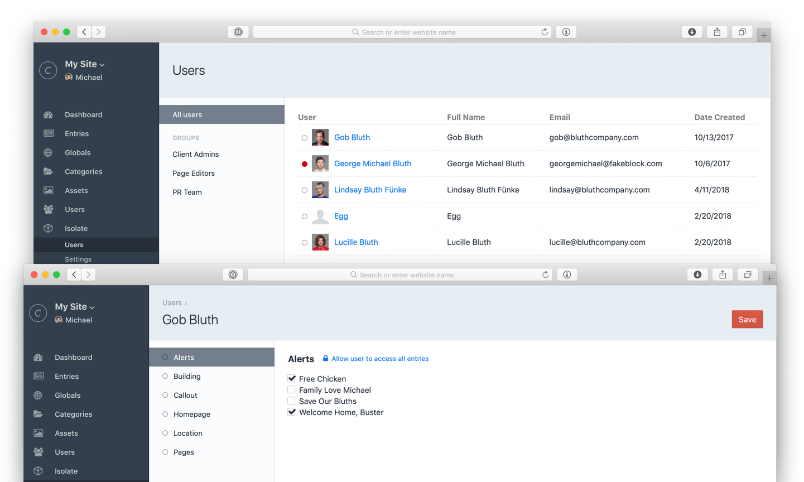

#  Isolate

Restrict your Craft CMS users on a per-entry basis

## What is Isolate?

Craft allows you to restrict users to specific content types, but you cannot scope users to only specific _entries_ in those content types. Isolate is a user management tool to manage users on a per-entry basis.

## What happens when I install it?

Isolate does three things after installation:

1. It creates a new Isolate database table to track specific entries a user should have access to
2. It provides a user administration section so you can easily track and assign entries a user can have access to
3. It provides a restricted entries area to any users who are restricted or "isolated" from certain entries

## What happens when I uninstall it?

Uninstalling Isolate simply deletes the database table that tracks the entries a user is isolated from. At this point your users will have access to all entries within the sections they are assigned—the native Craft behavior.

## Requirements

This plugin requires Craft CMS 3.0.0-beta.23 or later.

## Installation

To install the plugin, follow these instructions.

1. Open your terminal and go to your Craft project:

        cd /path/to/project

2. Then tell Composer to load the plugin:

        composer require trendyminds/isolate

3. In the Control Panel, go to Settings → Plugins and click the “Install” button for Isolate.

4. Configure the path to your components directory within Isolate's settings

## Attribution
[Box by Naveen from the Noun Project](https://thenounproject.com/search/?q=box&i=1489677)
