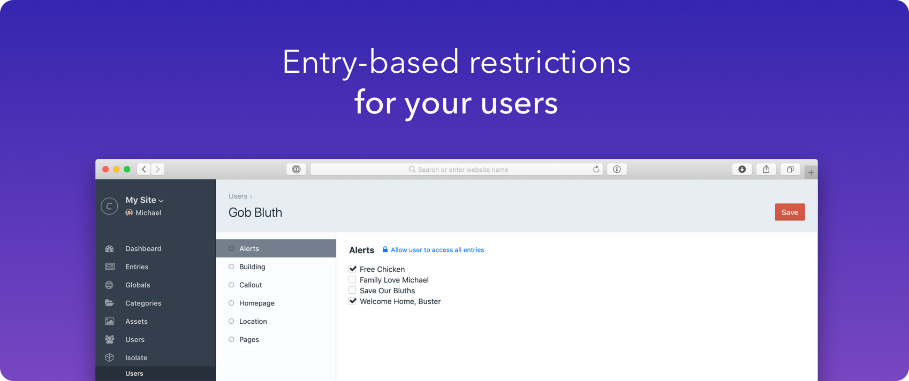
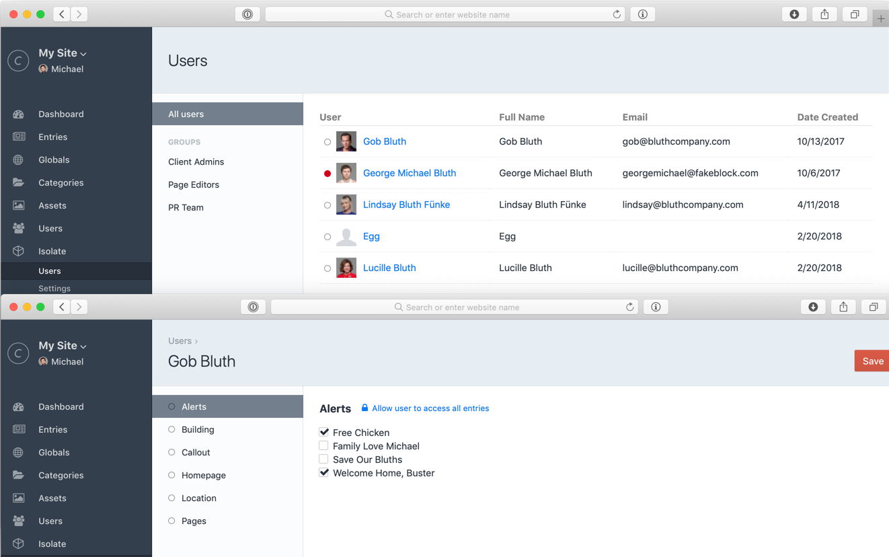
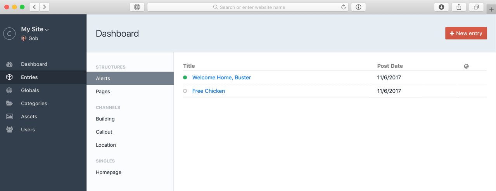

#  Isolate

## Craft 5+ Plans
With all the new slide-out functionality in Craft, and the [entrification](https://craftcms.com/blog/entrification) plan for Craft 5+ we aren't planning to update Isolate to be Craft 5+ compatible. There's just too many scenarios to account for (including things like multisite, as well).

Would love to something comparable baked into Craft natively at some point, but I'm sure the Pixel and Tonic folks have their hands full with all [other planned items](https://craftcms.com/roadmap)!

## What is Isolate?

Craft allows you to restrict users to specific content types, but you cannot scope users to only specific _entries_ in those content types. Isolate is a user management tool to manage users on a per-entry basis.

## What happens when I install it?

Isolate does three things after installation:

1. It creates a new Isolate database table to track specific entries a user should have access to
2. It provides a user administration section so you can easily track and assign entries a user can have access to
3. It provides a restricted entries area to any users who are restricted or "isolated" from certain entries

## What happens when I uninstall it?

Uninstalling Isolate simply deletes the database table that tracks the entries a user is isolated from. At this point your users will have access to all entries within the sections they are assigned—the native Craft behavior.

## How are users restricted?

Restriction is handled two ways:

1. A user that is isolated receives a custom, restricted dashboard. This ensures they only see the entries they can edit.
2. When a user attempts to access an entry edit page Isolate compares this ID to the list of IDs the user has access to. This ensures the user is safely restricted from the standard Entries dashboard and any entries they've been restricted from.

## Installation

[Install Isolate from the Craft CMS Plugin Store!](https://plugins.craftcms.com/isolate)

## Attribution
[Box by Naveen from the Noun Project](https://thenounproject.com/search/?q=box&i=1489677)
